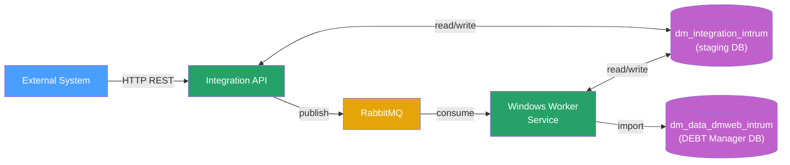

| Nazwa | Rola |
| --- | --- |
| External system | Zewnętrzny system/usługa przekazująca żądanie importu do API |
| Integrations Api | Usługa API Integracyjnego (opisana w rozdziale [Funkcje API](../funkcje-api/index.md)) odpowiedzialna za obsługę importu i jego statuowanie |
| Rabbit MQ | Serwer kolejek Rabbit MQ zapewniający asynchroniczną komunikację w API (opisane w rozdziale [Kolejki](../kolejki/index.md)) |
| API staging database (dm\_integration\_intrum) | Baza danych API Integracyjnego wykorzystywana do przetwarzania danych zanim finalnie zostaną one zaimportowane do bazy DEBT Manager |
| Windows worker Service | Usługi serwisów Windows pełniące role konsumentów wiadomości wpadających na serwer kolejek Rabbit MQ. |
| DEBT Manager database (dm\_data\_dmweb\_intrum) | Baza danych systemu DEBT Manager do której importowane są dane |
