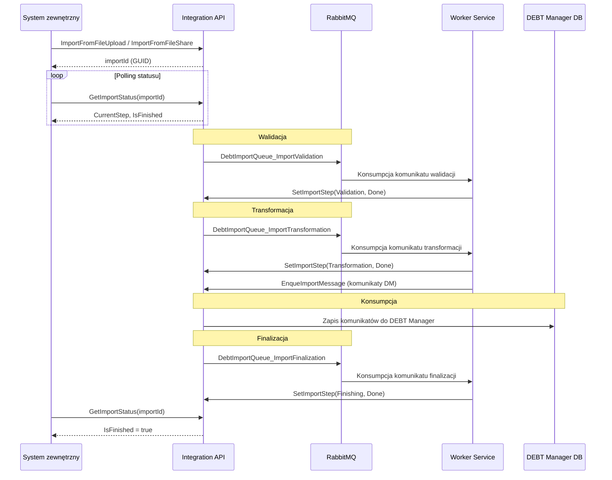

Poniższy diagram prezentuje typowy diagram sekwencji użycia funkcji API w celu przeprowadzenia importu:

```mermaid
sequenceDiagram
    participant ES as System zewnętrzny
    participant API as Integration API
    participant RMQ as RabbitMQ
    participant WS as Worker Service
    participant DB as DEBT Manager DB

    ES->>API: ImportFromFileUpload / ImportFromFileShare
    API-->>ES: importId (GUID)

    loop Polling statusu
        ES->>API: GetImportStatus(importId)
        API-->>ES: CurrentStep, IsFinished
    end

    Note over API,RMQ: Walidacja
    API->>RMQ: DebtImportQueue_ImportValidation
    RMQ->>WS: Konsumpcja komunikatu walidacji
    WS->>API: SetImportStep(Validation, Done)

    Note over API,RMQ: Transformacja
    API->>RMQ: DebtImportQueue_ImportTransformation
    RMQ->>WS: Konsumpcja komunikatu transformacji
    WS->>API: SetImportStep(Transformation, Done)
    WS->>API: EnqueImportMessage (komunikaty DM)

    Note over API,DB: Konsumpcja
    API->>DB: Zapis komunikatów do DEBT Manager

    Note over API,RMQ: Finalizacja
    API->>RMQ: DebtImportQueue_ImportFinalization
    RMQ->>WS: Konsumpcja komunikatu finalizacji
    WS->>API: SetImportStep(Finishing, Done)

    ES->>API: GetImportStatus(importId)
    API-->>ES: IsFinished = true
```
