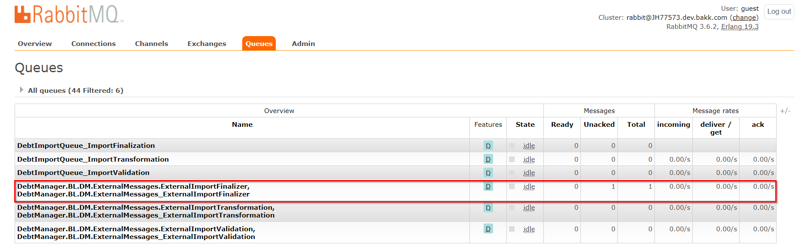

# Kolejki

Rola kolejek w API

W ramach API integracyjnego wykorzystywane są kolejki danych, które pełnią następującą rolę:

- **Asynchroniczne przetwarzanie** — zapewniają asynchroniczne przetwarzanie danych.
- **Delegacja przetwarzania** — pozwalają na przeniesienie wybranych elementów przetwarzania danych do systemów zewnętrznych w stosunku do API, np. walidacja importu może zostać wykonana przez zewnętrzny system, który pobiera komunikat o konieczności walidacji z kolejki, wykonuje walidację i informuje API o wyniku.

---

Wykaz kolejek

Kolejki RabbitMQ — walidacja

<ul class="param-list">
  <li>
    DebtImportQueue_ImportValidation
    RabbitMQ
    Kolejka zawierająca importy dla których należy wykonać krok walidacji danych. Konsumowana przez <strong>system DEBT Manager</strong>.
  </li>
  <li>
    ExternalImportValidation
    RabbitMQ
    Jak wyżej — wersja konsumowana przez <strong>system zewnętrzny</strong>. <code>DebtManager.BL.DM.ExternalMessages.ExternalImportValidation</code>
  </li>
</ul>

Kolejki RabbitMQ — transformacja

<ul class="param-list">
  <li>
    DebtImportQueue_ImportTransformation
    RabbitMQ
    Kolejka zawierająca importy dla których należy wykonać krok transformacji danych z importu na komunikaty. Konsumowana przez <strong>system DEBT Manager</strong>.
  </li>
  <li>
    ExternalImportTransformation
    RabbitMQ
    Jak wyżej — wersja konsumowana przez <strong>system zewnętrzny</strong>. <code>DebtManager.BL.DM.ExternalMessages.ExternalImportTransformation</code>
  </li>
</ul>

Kolejki RabbitMQ — finalizacja

<ul class="param-list">
  <li>
    DebtImportQueue_ImportFinalization
    RabbitMQ
    Kolejka zawierająca importy które zostały zakończone, dająca możliwość wykonania kolejnych kroków po imporcie — np. uruchomienie workflowów na zaimportowanych sprawach (sukces) lub usunięcie danych (błąd). Konsumowana przez <strong>system DEBT Manager</strong>.
  </li>
  <li>
    ExternalImportFinalizer
    RabbitMQ
    Jak wyżej — wersja konsumowana przez <strong>system zewnętrzny</strong>. <code>DebtManager.BL.DM.ExternalMessages.ExternalImportFinalizer</code>
  </li>
</ul>

Kolejki SQL Server — komunikaty

<ul class="param-list">
  <li>
    dm_messages.[nazwa_komunikatu]
    SQL Server
    Dla każdego komunikatu istnieje w bazie API Integracyjnego (<code>dm_integration_[nazwa]</code>, schemat <code>dm_messages</code>) tabela pełniąca rolę kolejki danego komunikatu. Konsumowana przez <strong>system DEBT Manager</strong>. Szczegółowy opis zastosowanego rozwiązania: <a href="https://www.mssqltips.com/sqlservertip/1155/sql-server-database-specific-settings-service-broker/">Service Broker pattern</a>.
  </li>
</ul>

---

Przykład stanu kolejek

Poniższy zrzut prezentuje status kolejek API integracyjnego w czasie gdy wykonujemy typ importu obsługiwany przez system zewnętrzny i jesteśmy w trakcie ostatniego kroku — finalizacji importu:

