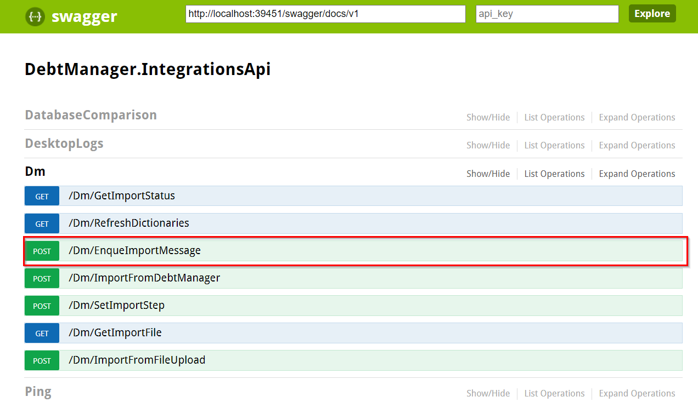
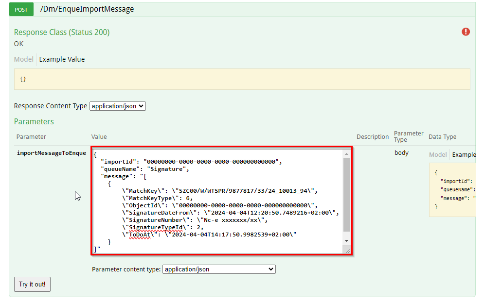
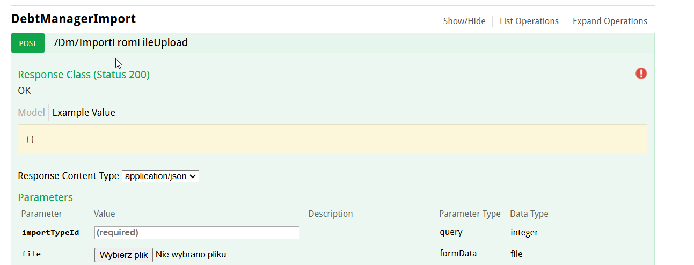
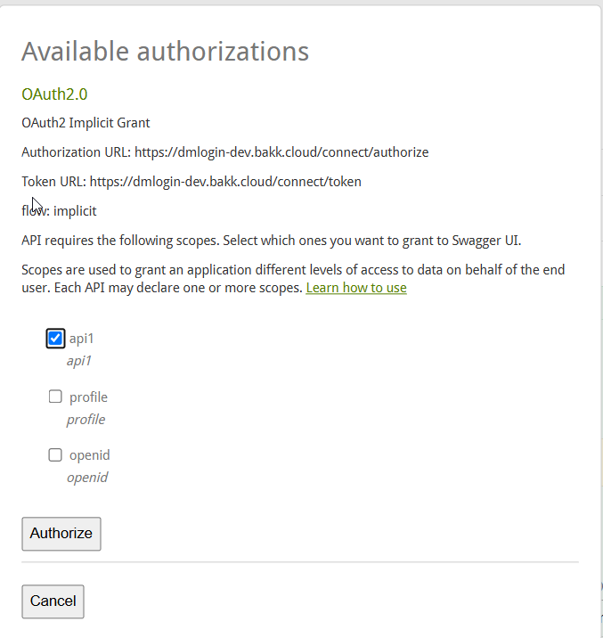
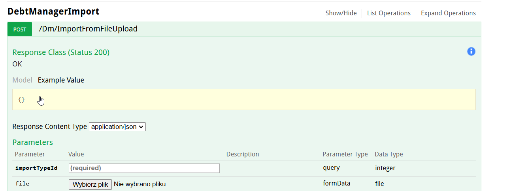

W celu zasilenia systemu pojedynczym komunikatem:

0) Jednorazowo zalogować się do Swaggera zgodnie z opisem w punkcie Uruchomienie Swaggera dla serwera autentykacji

1) Łączymy się do API [http://\[adres\_serwera\]:39451/swagger/ui/index#/Dm](http://localhost:39451/swagger/ui/index#/Dm) i wybieramy funkcję API [EnqueImportMessage](../funkcje-api/importy/enque-import-message.md). W przypadku gdy logowanie do API oparte jest o login/hasło jednorazowo autoryzujemy się w API (patrz paragraf na dole rozdziału)

2) Podajemy parametry funkcji:

-   importId - pusty GUID, bo import odbywa się jako zasilenie komunikatami bez importowania pliku
-   queueName - nazwa kolejki, zgodna z wykazem komunikatów z rozdziału [Komunikaty](../komunikaty/index.md)
-   message - lista komunikatów, którymi chcemy zasilić w ramach kolejki z parametru queueName (przykłady składni JSON komunikatów można znaleźć w rozdziale [Komunikaty](../komunikaty/index.md))

3) Klikamy przycisk "Try it out!" - w odpowiedzi dostajemy wynik żądania importu

4) Czekamy na zakończenie asynchronicznego przetwarzania. Następnie sprawdzamy zmienione dane w aplikacji DEBT Manager

**Uruchomienie Swaggera dla serwera autentykacji**

Aby móc wywołać metody Swaggera wymagana jest autentykacji w serwerze autentykacji. Przed wywołaniem metody w Swaggerze, użytkownik musi się zalogować (uzyskać token). Metody wymagające autoryzacji oznaczone są czerwonym wykrzyknikiem.

Po kliknięciu w ikonę wykrzyknika otworzy się okno w którym należy wybrać opcje api1 i kliknać przycisk Authorize

Po poprawnym zalogowaniu się (uzyskaniu tokena) ikona przy metodzie zmieni się na niebieskie 'i'

