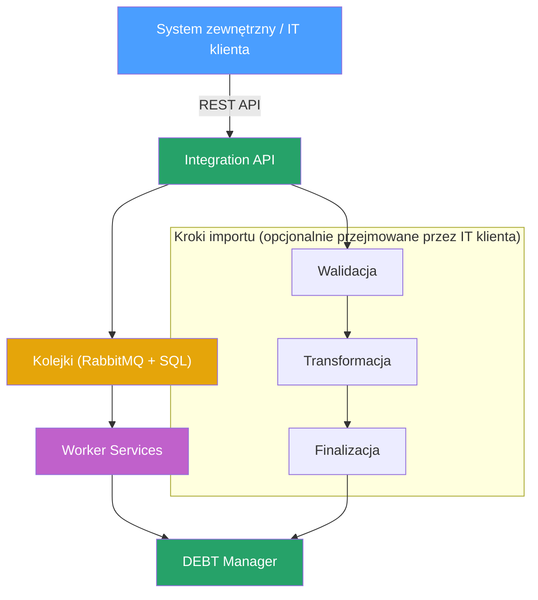

System posiada API Integracyjne, którego celem jest umożliwienie przygotowywania importu danych kontrahentów np. importowanie nowych spraw do obsługi.

**Założenia działania importów danych**

-   System posiada API integracyjne, które udostępnia zestaw uniwersalnych i reużywalnych komunikatów pozwalających zasilić system np. dodaj sprawę, dodaj wpłatę, dodaj adres dłużnika, dodaj akcję, dodaj sygnaturę
-   API integracyjne można zasilić bezpośrednio poprzez wywołanie usługi
-   API integracyjne kolejkuje przekazane komunikaty i przetwarza je wykorzystując tyle zasobów ile aktualnie posiada system ( z możliwością zwiększenia mocy przetwarzania poprzez dodanie kolejnych maszyn konsumujących dane z kolejek)
-   API integracyjne zasila system w trybie rzeczywistym, nie powodując zablokowania systemu DEBT Manager w trakcie zasilania
-   Dostawca przygotowuje i utrzymuje API integracyjne, ale zasilanie danymi API integracyjnego może być wykonywane przez IT klienta. Dodatkowo IT klienta może przejąć na siebie wykonanie poszczególnych kroków importu:
    -   Walidacja importu - zweryfikowanie czy dane, które chcemy zaimportować do systemu są poprawne
    -   Transformacja importu - zmapowanie danych na zrozumiałe przez system komunikaty
    -   Finalizacja importu - wykonanie czynności po zakończeniu importu np. poinformowanie zewnętrznego partnera, że import nie wykonał się poprawnie na skutek błędów w walidacji pliku importowego.

Szczegóły procedury konfiguracji nowego importu oraz procedurę importowania danych od kontrahenta opisano w rozdziałach: [Konfiguracja nowego kontrahenta](konfiguracja-kontrahenta.md) i [Procedura importów danych od kontrahenta](procedura-importow.md)
