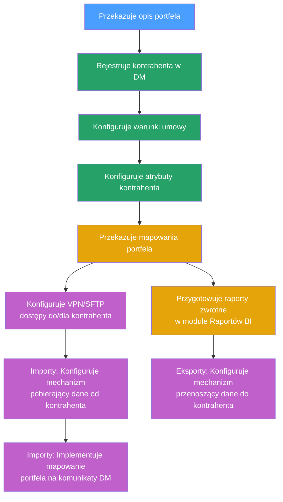

Zadanie skonfigurowania nowego kontrahenta wiąże się z krokami, który opisuje poniższy diagram:

**Legenda:** :blue_square: Kontrahent | :green_square: Biznes | :yellow_square: Biznes/Analityk | :purple_square: IT

| Nazwa kroku | Odpowiedzialny | Opis kroku |
| --- | --- | --- |
| Przekazuje opis portfela | Kontrahent | Kontrahent przekazuje dokumentacje nowego portfela:specyfikacje plików importowych oraz przykłady plikówspecyfikacje plików eksportowychwytyczne biznesowe do obsługi np. czy można kapitalizować odsetki, sposób rozliczenia wpłat |
| Rejestruje kontrahenta w DM | Biznes | W ramach aplikacji DM użytkownik dodaje sprawę kontrahenta oraz sprawę handlowa (umowę dla kontrahenta) |
| Konfiguruje warunki umowy | Biznes | W ramach aplikacji DM użytkownik w sprawie handlowej przygotowuje warunki umowy, które zawierają parametry umowy, które system wykorzystuje do pracy operacyjnej na przekazanych sprawachnp. stawki prowizyjne wykorzystywane do rozliczeń, warunki windykacji (czy można kapitalizować odsetki, czy można dodawać ugody itp.) |
| Konfiguruje atrybuty kontrahenta | Biznes | W ramach aplikacji DM użytkownik konfiguruje dodatkowe pola opisujące kontrahenta lub umowę, które nie wpływają na operacyjną prace systemu np. dane wykorzystywane w raportowaniu, budżetowaniu itp. |
| Przekazuje mapowania portfela | Biznes/Analityk | Przekazuje dla IT mapowania w jaki sposób pliki importowe mają mapować się na odpowiednie pola w aplikacji DM. Np. który adres z pliku importowego to adres zameldowania, jakie są reguły walidacji pliku itd. |
| Przygotowuje raporty zwrotnedo kontrahentaw module Raportów BI | Biznes/Analityk | Przygotowuje w ramach modułu Raportów BI raporty, które wydobywają dane potrzebne do zasilenia plików eksportowych |
| Konfiguruje VPN/SFTP dostępydo/dla kontrahenta | IT | IT konfiguruje z kontrahentem VPN oraz dostępy SFTP wykorzystywane do wymiany plikowej. |
| Importy: Konfiguruje mechanizm, który pobierzedane od kontrahenta | IT | IT konfiguruje mechanizm, który pobierze pliki od kontrahenta i przeniesie je do Intrum |
| Importy: Implementuje mapowanie portfela wmechanizmie transformującym daneKontrahenta na komunikaty DM | IT | IT, na podstawie mapowań dostarczonych od biznesu, implementuje mechanizm który transformuje dane z plików kontrahenta na komunikaty DM |
| Eksporty: Konfiguruje mechanizm, który przeniesiedane do kontrahenta | IT | IT, na podstawie specyfikacji kontrahenta, implementuje mechanizm który sformatuje pliki eksportów wystawione przez DM do oczekiwanego przez kontrahenta formatu oraz konfiguruje mechanizm przenoszący te pliki z udziałów Intrum do udziałów sieciowych do których dostęp ma kontrahent. |
