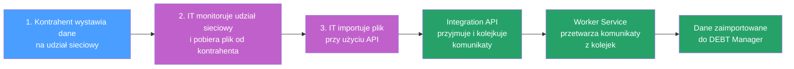

Import danych od kontrahenta składa się z następujących kroków, która bardziej szczegółowo prezentuje poniższy diagram:

**Legenda:** :blue_square: Kontrahent | :purple_square: IT | :green_square: System

1) Kontrahent wystawia dane na udział sieciowy

2) IT monitoruje udział sieciowy i pobiera plik od kontrahenta

3) IT importuje plik przy użyciu API (techniczna specyfikacja tego kroku znajduje się w rozdziale [Funkcje API > Importy](../funkcje-api/importy/index.md))
